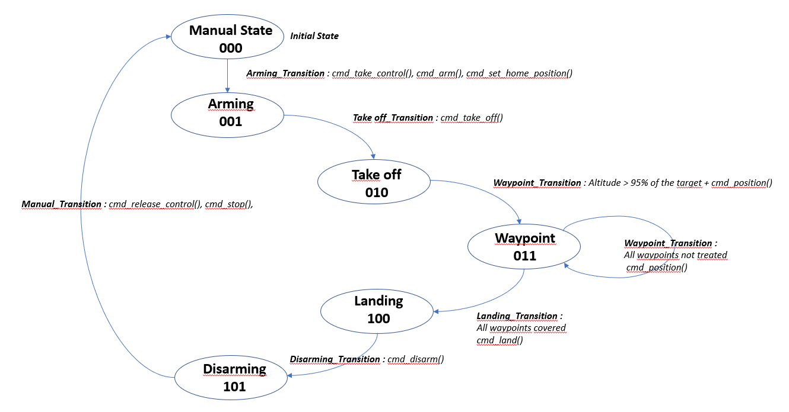

### Backyard Flyer - Finite State Machine implementation for autonomously flying Drone
--------------------------
#### Target
The target of this project is to design a finite state machine using event-driven programming for autonomously flying a drone. 

Support : flying a quadcopter in a Unity simulator.

The written python code is similar to how the drone would be controlled from a ground station computer or an onboard flight computer. 

The communication with the drone is done using MAVLink.

-------------------------
#### Detailled Requirements
The required task is to command the drone to fly a 10 meter box at a 5 meter altitude. 

Two ways to fly : first using manual control and then under autonomous control.

Manual control of the drone is done using the instructions found with the simulator.

Autonomous control will be done using an event-driven state machine. 
Each callback function checks against transition criteria dependent on the current state. If the transition criteria are met, it will transition to the next state and pass along any required commands to the drone.

-------------------------
#### SW Architecture
##### Command from the UdaciDrone API's `Drone`
The  UdaciDrone API's `Drone` class delivers a list of command. They are described in [this repository](https://udacity.github.io/udacidrone/docs/drone-api.html);

#####  Finite State Machine (Mealy concept : asynchonous design)
The "Mealy machine" (asynchronous graph) described the SW architecture :
<p align="center">

</p> 

##### Callback Fonction Concept
While the drone is in each state, the state machine will need to check transition criteria with a registered callback. 
If the transition criteria are met, the state machine will set the next state and pass along any commands to the drone. 
For example:
```python
def state_callback(self):
	if self.state == States.DISARMING:
    	if !self.armed:
        	self.release_control()
        	self.in_mission = False
        	self.state = States.MANUAL
```

This is a callback on the state message. It only checks anything if it's in the DISARMING state. If it detects that the drone is successfully disarmed, it sets the mode back to manual and terminates the mission. 

--------------------------
#### SW Design and Description
##### Drone Attributes
The `Drone` class contains the following attributes that you may find useful for this project:

 - `self.armed`: boolean for the drone's armed state
 - `self.guided`: boolean for the drone's guided state (if the script has control or not)
 - `self.local_position`: a vector of the current position in NED coordinates
 - `self.local_velocity`: a vector of the current velocity in NED coordinates

##### Outgoing Commands
The UdaciDrone API's `Drone` class also contains function to be able to send commands to the drone.

 - `connect()`: Starts receiving messages from the drone. Blocks the code until the first message is received
 - `start()`: Start receiving messages from the drone. If the connection is not threaded, this will block the code.
 - `arm()`: Arms the motors of the quad, the rotors will spin slowly. The drone cannot takeoff until armed first
 - `disarm()`: Disarms the motors of the quad. The quadcopter cannot be disarmed in the air
 - `take_control()`: Set the command mode of the quad to guided
 - `release_control()`: Set the command mode of the quad to manual
 - `cmd_position(north, east, down, heading)`: Command the drone to travel to the local position (north, east, down). Also commands the quad to maintain a specified heading
 - `takeoff(target_altitude)`: Takeoff from the current location to the specified global altitude
 - `land()`: Land in the current position
 - `stop()`: Terminate the connection with the drone and close the telemetry log

##### Autonomous Control State Machine
The state machine is run continuously until either the mission is ended or the Mavlink connection is lost.

The six states predefined for the state machine:
* MANUAL: the drone is being controlled by the user
* ARMING: the drone is in guided mode and being armed
* TAKEOFF: the drone is taking off from the ground
* WAYPOINT: the drone is flying to a specified target position
* LANDING: the drone is landing on the ground
* DISARMING: the drone is disarming

--------------------------
####  SW Environment
##### Step 1: Download the Simulator and Miniconda
Download the version of the simulator that's appropriate for your operating system [from this repository](https://github.com/udacity/FCND-Simulator-Releases/releases).
Download Miniconda with Python 3.6 [from this repository]
(https://conda.io/miniconda.html)

##### Step 2: Set up your Python Environment
Set up your Python environment and get all the relevant packages installed using Anaconda following instructions in [this repository](https://github.com/udacity/FCND-Term1-Starter-Kit)

##### Step 3: Clone this Repository
```sh
git clone https://github.com/udacity/FCND-Backyard-Flyer
```
#### Step 4 : FCND environement activation
Update the latest conda version with this command in the "miniconda prompt window" : 
```sh
conda update -n base conda
```

Conda environment for the project creation with this command in the "miniconda prompt window" :
```
conda env create -f environment.yml
```

FCND environment activation with this command in the "miniconda prompt window" :
```sh
conda activate FCND or source activate FCND
```

##### Step 5 :Running the State Machine
Run the code in the "miniconda prompt" window with the command : 
```sh
python backyard_flyer.py
```

##### Step 6 : Drone Mission visualization in the simulator
Run the drone simulator : the drone makes the sqaure with the 4 waypoints.
Information : The drones moves slowly beacuse the deadband radius is initialized with 0,1 meters in the code. 
The precision to reach a waypoint is prefered to the speed realization. 
In others case, with a deadband radius = 10 meters, the speed realisation will be prefered as the precision.

--------------------------
#### Results
##### Message Logging
The telemetry data is automatically logged in "Logs\TLog.txt" or "Logs\TLog-manual.txt" for logs created when running `python drone.py`. Each row contains a comma seperated representation of each message. The first row is the incoming message type. The second row is the time. The rest of the rows contains all the message properties. The types of messages relevant to this project are:

* `MsgID.STATE`: time (ms), armed (bool), guided (bool)
* `MsgID.GLOBAL_POSITION`: time (ms), longitude (deg), latitude (deg), altitude (meter)
* `MsgID.GLOBAL_HOME`: time (ms), longitude (deg), latitude (deg), altitude (meter)
* `MsgID.LOCAL_POSITION`: time (ms), north (meter), east (meter), down (meter)
* `MsgID.LOCAL_VELOCITY`: time (ms), north (meter), east (meter), down (meter) 

##### Reading Telemetry Logs
Logs can be read using:

```python
t_log = Drone.read_telemetry_data(filename)
```

The data is stored as a dictionary of message types. For each message type, there is a list of numpy arrays. For example, to access the longitude and latitude from a `MsgID.GLOBAL_POSITION`:

```python
# Time is always the first entry in the list
time = t_log['MsgID.GLOBAL_POSITION'][0][:]
longitude = t_log['MsgID.GLOBAL_POSITION'][1][:]
latitude = t_log['MsgID.GLOBAL_POSITION'][2][:]
```

The data between different messages will not be time synced since they are recorded at different times.


     


